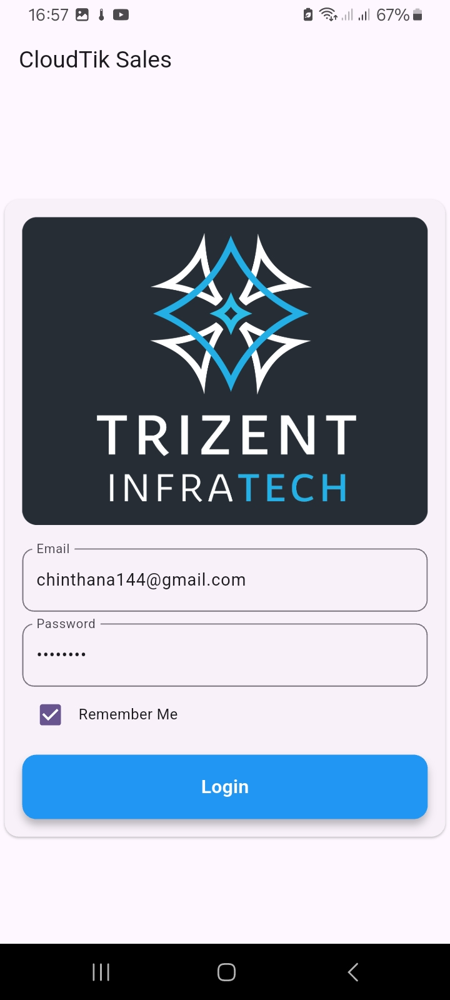
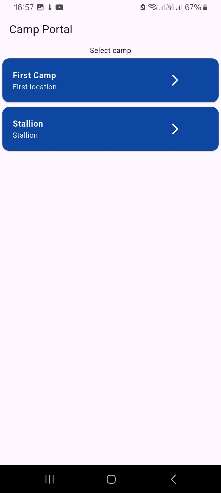
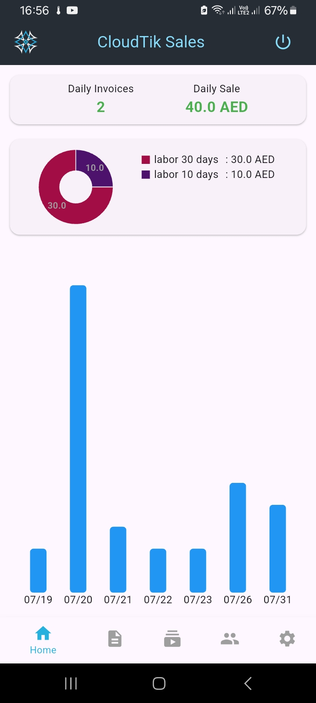
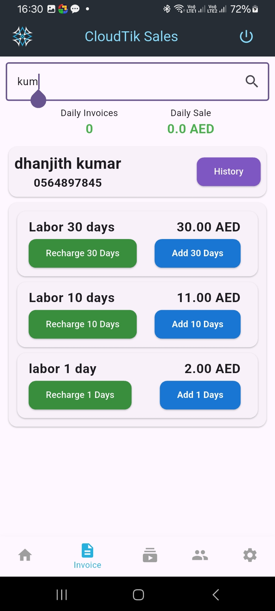
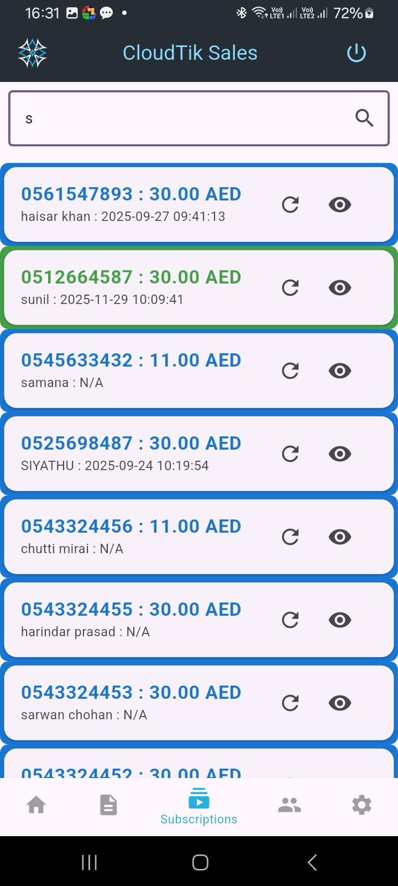
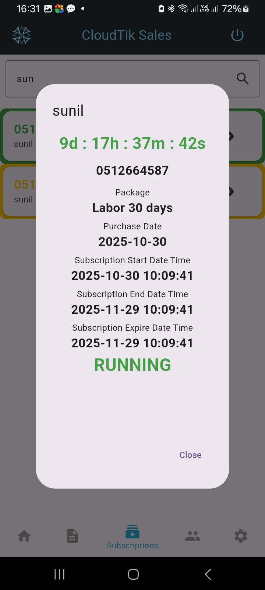
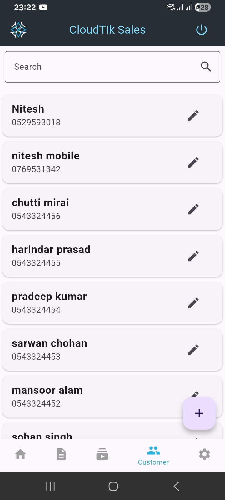
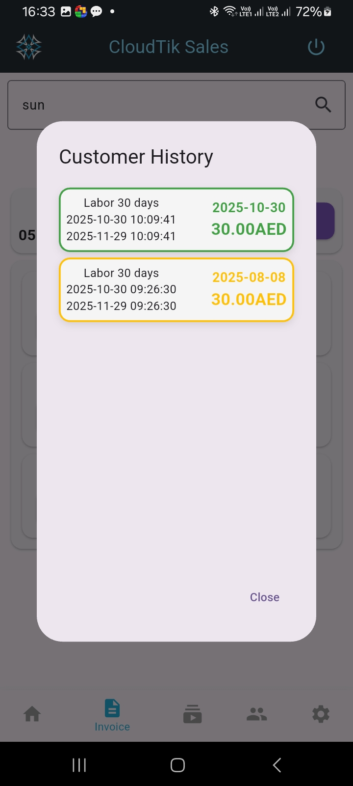
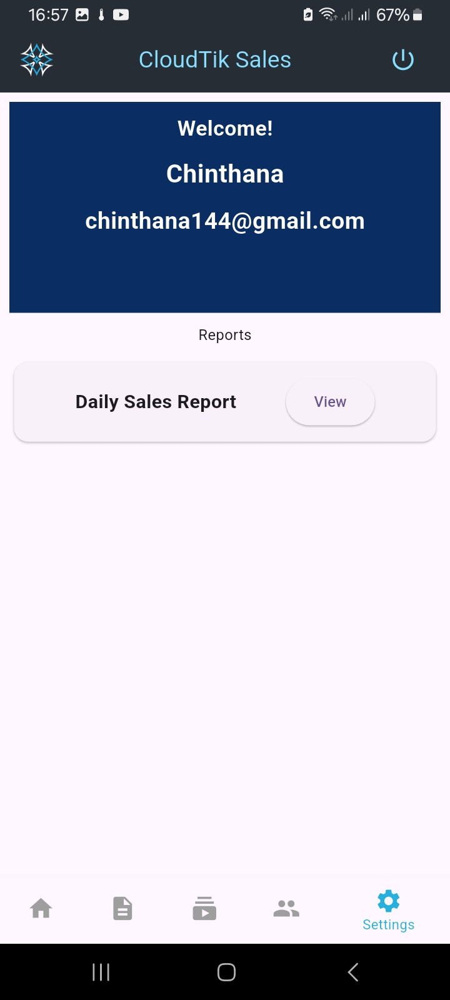

# CloudTik Sales – Mobile Application
CloudTik Sales is a Flutter-based mobile application designed for sales teams working in labor camps.
It connects with the CloudTik web backend to manage customer registrations, subscriptions, MAC address resets, and sales trackin

salesman application for CloudTik

--- 

## Features
### Customer Management
- Add new customers
- Edit customer information
- Assign customers to camps
- Search and filter customers

### Device & MAC Management
- Register customer device MAC address
- Reset MAC address (RouterOS API via backend)
- View device activity

### Subscription Management
- Create subscription
- Reset subscription
- Package selection by customer type
- View subscription history

### Invoices
- Generate invoice from the mobile app
- View invoice history
- Syncs with CloudTik web system

### Sales Tracking
- Daily sales
- Total sales
- Sales history
- Performance dashboard

### User Access Control
- Login based on designation
- Only authorized roles can register or manage customers

--- 

## Screenshots

    
    
    

    
    
    

    
    
    

--- 

## Tech Stack
- **Framework:** Flutter (3.x)
- **Language:** Dart
- **Architecture:** Provider / MVVM (your choice)
- **Backend:** CloudTik Laravel API
- **State Management:** Provider
- **HTTP Client:** Dio / http package
- **Database:** Local storage (SharedPreferences)

## Installation Guide

### Clone the repository

    git clone https://github.com/Chinthana144/CloudTik-Sales.git
    cd CloudTik-Sales

### Install dependencies

    flutter pub get

### Run the app

    flutter run

## Build APK
    
    flutter build apk --release

The APK will be available in:

    /build/app/outputs/flutter-apk/app-release.apk

---

## Future Improvements
- Camp transfer option
- QR code authentication
- Voucher sale option

--- 

## Connect with me
- LinkedIn: *www.linkedin.com/in/chinthana-edirisinghe-42399321a*
- Email: *chinthana144@gmail.com*

Thanks for visiting my profile!
